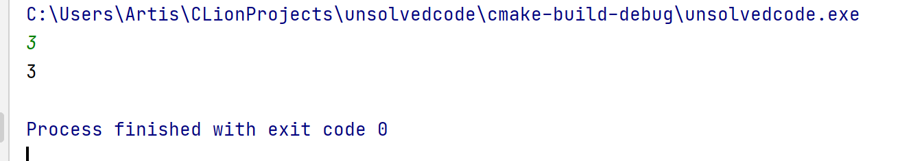
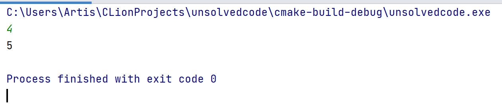
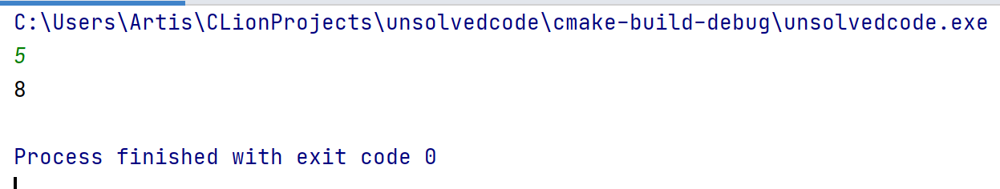
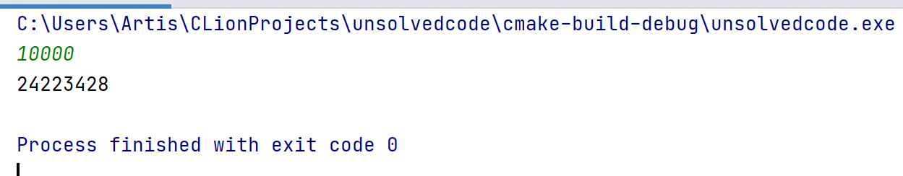
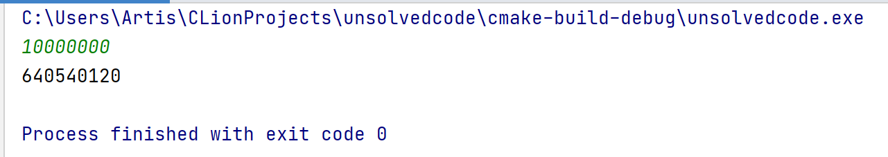
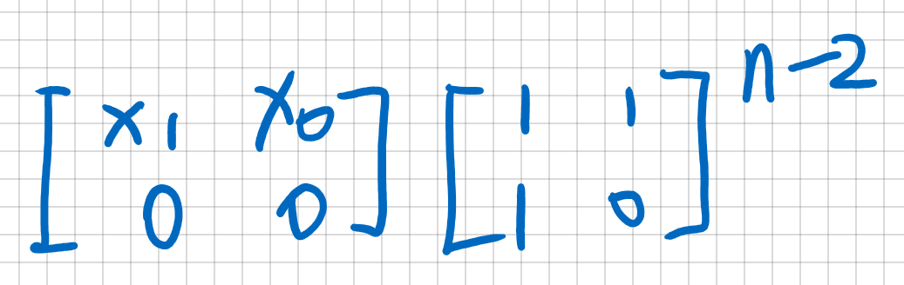
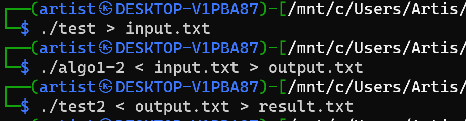
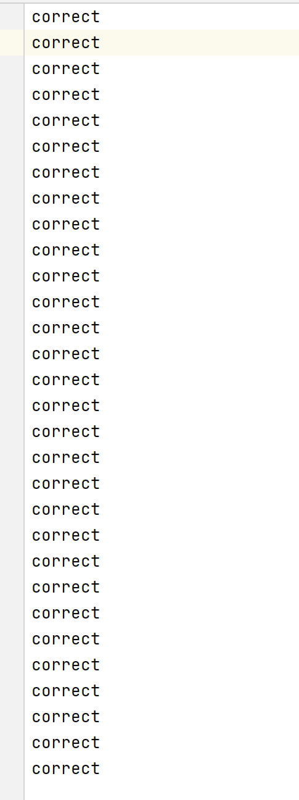
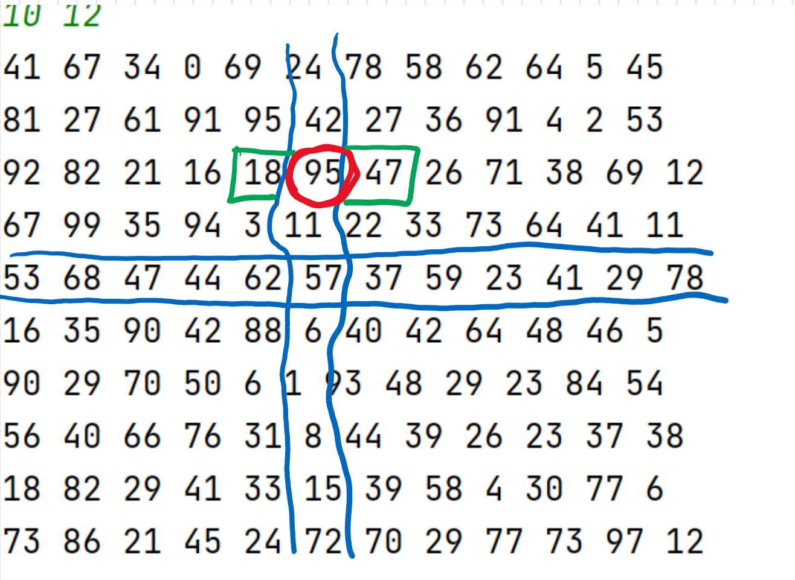

# Problem 1-1

## code

```c++
#include<bits/stdc++.h>

using namespace std;
typedef long long ll;
const int mod = 1e9 + 7;

// sol1: 普通递归O(2^n)
ll cal(int n) {
    if (n == 1) return 1;
    if (n == 2) return 2;
    return cal(n - 1) + cal(n - 2);
}

// sol2: 递推O(n)
ll cal2(int n) {
    if (n == 1) return 1;
    ll ans[2];
    ans[0] = 2, ans[1] = 1;
    int t = 0;
    for (int i = 3; i <= n; ++i) {
        ans[t ^ 1] = (ans[t] + ans[t ^ 1]) % mod;
        t ^= 1;
    }
    return ans[t];
}

// sol3: 公式+快速幂O(lg n)
double fastm(double a,int n){
    double ans = 1.0;
    while(n){
        if(n&1) ans = a*ans;
        a=a*a;
        n>>=1;
    }
    return ans;
}

// 公式
ll cal3(int n){
    double root5 = sqrt(5);
    return (ll)((1+root5)/(2*root5)*fastm((1+root5)/2,n)+(3-root5)/(5-root5)*fastm((1-root5)/2,n));
}

// sol4: 矩阵快速幂计算O(lg n)
/*
 * [x_2, x_1]   [ 1 , 1  ]^(n-2)
 * [ 0 ,  0 ]   [ 1 , 0  ]
 *
 */

struct Matrix {
    ll m[2][2];

    Matrix() {
        memset(m, 0, sizeof(m));
    }
};

Matrix Multi(Matrix a, Matrix b) {
    Matrix res;
    for (int i = 0; i < 2; ++i)
        for (int j = 0; j < 2; ++j)
            for (int k = 0; k < 2; ++k)
                res.m[i][j] = (res.m[i][j] + a.m[i][k] * b.m[k][j]) % mod;
    return res;
}

Matrix fastm(Matrix a, int n) {
    Matrix res;
    for (int i = 0; i < 2; ++i) res.m[i][i] = 1;
    while (n) {
        if (n & 1) res = Multi(res, a);
        a = Multi(a, a);
        n >>= 1;
    }
    return res;
}

int main() {
    int n;
    cin >> n;
   // cout << cal(n) << endl;
   // cout << cal2(n) << endl;
    if (n == 1) {
        cout << 1 << endl;
        return 0;
    }
    if (n == 2) {
        cout << 2 << endl;
        return 0;
    }
    cout << cal3(n) << endl; // 可换成cal1,cal2,或下面注释
    /*
    Matrix cur, pro;
    cur.m[0][0] = 2, cur.m[0][1] = 1;
    pro.m[0][0] = pro.m[0][1] = pro.m[1][0] = 1;
    cout << Multi(cur, fastm(pro, n - 2)).m[0][0] << endl;
     */

}

```
## Results












we can also input numbers that are larger than the size of integer since the time complexity is O(lg n).

## Algorithm description

for solution 1:

We use recursion to solve the problem. To climb to the $n$ th step, there are two situations, one is to take one step from the $n-1$ th step, and the second is to take two steps from the $n-2$ th step. Then the problem switches to climb the $n-1$ th and $n-2$ th step.

$$f(x) = f(x-1) + f(x-2)$$

However, since this solution will divide a function into two function with only slightly small size, it will take $O(2^n)$ time to solve, which is really slow. (space complexity is also $O(2^n)$, since we invoke that much functions)

## Other solutions

for solution 2:

As stated above, this problem can be divided into two sub-problems, and the two have the parameters smaller than the original function's parameter for only 1. Moreover, the two sub-problems are crossed with each other. Therefore, we can write a linear for-loop and use only two space to store the intermediate values. For convenience, I use XOR operation to switch between the two space.
The time complexity is $O(n)$, and space complexity is $O(1)$.

for solution 3:

We can directly derive the formula for this linear recurrence relation.
The auxiliary equation for this recurrence relation is:
$$x^{n+2} = x^{n+1} + x^n$$
We get the two roots: $x_1 = \frac{1+\sqrt{5}}{2}, x_2 = \frac{1-\sqrt{5}}{2}$.

The formula is in the form: $c_1{x_1}^n + c_2{x_2}^n$.

put $f_1 = 1, f_2 = 2$ into the formula, we can get:

$$c_1\times \frac{1+\sqrt{5}}{2}+c_2\times \frac{1-\sqrt{5}}{2} = 1$$
$$c_1\times {(\frac{1+\sqrt{5}}{2})}^2+c_2\times {(\frac{1-\sqrt{5}}{2})}^2 = 2$$

We get $c_1 = \frac{1+\sqrt{5}}{2\sqrt{5}},c_2 = \frac{\sqrt{5}-3}{\sqrt{5}-5}$.

Therefore, the formula is $f_n = \frac{1+\sqrt{5}}{2\sqrt{5}}\times {(\frac{1+\sqrt{5}}{2})}^n + \frac{\sqrt{5}-3}{\sqrt{5}-5}\times {(\frac{1-\sqrt{5}}{2})}^n$.

We use fast power to accelerate this procedure. It needs $O(lg n)$time.
But there might be precision problem since we are using float point. Actually we can use Quadratic residue(number theory) to use module to avoid this problem..

for solution 4:

We can find that this linear recurrence relation can be represented by matrix multiplication:



(not good at representing matrix in latex so directly use a pic)

Since we have a power calculation, we can use fast power to accelerate this process, whose idea is based on binary representation.

This solution takes only $O(lg n)$ time, and $O(1)$ space to store the matrix.

# Problem 1-2

## code

```c++
//
// Created by Artist on 2021/3/25.
//
#include<bits/stdc++.h>

using namespace std;


const int maxn = 1e3 + 3;
int a[maxn][maxn];

pair<int, int> solve(int sx, int sy, int tx, int ty) {
    int mx = (sx + tx) >> 1, my = (sy + ty) >> 1;// 中间十字
    int maxx = 0; // 中间十字最大值
    int posx, posy; // 中间十字最大值的位置
    for (int i = sx; i <= tx; ++i) if (a[i][my] > maxx) maxx = a[i][my], posx = i, posy = my;
    for (int j = sy; j <= ty; ++j) if (a[mx][j] > maxx) maxx = a[mx][j], posx = mx, posy = j;
    if (posx == mx && posy == my) return make_pair(posx, posy);
    if (posx == mx) { // 如果在中间行上
        if ((posx == sx || a[posx - 1][posy] <= a[posx][posy]) &&
            (posx == tx || a[posx + 1][posy] <= a[posx][posy]))
            return make_pair(posx, posy); // 如果大于上下两格
        if (posx != sx && a[posx - 1][posy] > a[posx][posy]) {
            if (posy <= my) return solve(sx, sy, mx - 1, my - 1);
            else return solve(sx, my + 1, mx - 1, ty); // 递归
        } else {
            if (posy <= my) return solve(mx + 1, sy, tx, my - 1);
            else return solve(mx + 1, my + 1, tx, ty);
        }
    } else { // 如果在中间列上
        if ((posy == sy || a[posx][posy - 1] <= a[posx][posy]) &&
            (posy == ty || a[posx][posy + 1] <= a[posx][posy]))
            return make_pair(posx, posy); // 如果大于左右两格
        if (posy != sy && a[posx][posy - 1] > a[posx][posy]) {
            if (posx <= mx) return solve(sx, sy, mx - 1, my - 1);
            else return solve(mx + 1, sy, tx, my - 1);
        } else {
            if (posx <= mx) return solve(sx, my + 1, mx - 1, ty);
            else return solve(mx + 1, my + 1, tx, ty);
        }
    }
}

void solve() {
    int n, m;
    cin >> n >> m;
    //cout << n << " " << m << endl;
    for (int i = 1; i <= n; ++i) for (int j = 1; j <= m; ++j) scanf("%d", &a[i][j]);
    //for (int i = 1; i <= n; ++i, cout << endl) for (int j = 1; j <= m; ++j) cout << a[i][j] << " ";

    pair<int, int> res = solve(1, 1, n, m);
    cout << res.first << " " << res.second << endl;
}

int main() {
    int t;
    cin >> t;
    //cout << t << endl;
    while (t--) solve();
}
```
## Results

```c++
//
// generate test data
//

#include<bits/stdc++.h>

using namespace std;

int mp[1002][1002];

int main() {
    int t = 30;
    cout << t << endl;
    while (t--) {
        int n = ((int) rand()) % 988 + 5;
        int m = ((int) rand()) % 988 + 5;
        cout << n << " " << m << endl;
        for (int i = 1; i <= n; ++i) {
            for (int j = 1; j <= m; ++j) {
                mp[i][j] = ((int) rand()) % 988 + 5;
                cout << mp[i][j] << " ";
            }
            cout << endl;
        }
        cout << endl;
    }
}
```
```c++
//
// O(n^2) evaluate the results produced by solution code
//

#include<bits/stdc++.h>

using namespace std;

int mp[1003][1003];

int main() {
    int t;
    cin >> t;
    while (t--) {
        int n, m;
        cin >> n >> m;
        for (int i = 1; i <= n; ++i) {
            for (int j = 1; j <= m; ++j) {
                scanf("%d", &mp[i][j]);
            }
        }
        int x, y;
        cin >> x >> y;
        int flg = 0;
        if (x > 1 && mp[x][y] < mp[x - 1][y]) flg = 1;
        if (y > 1 && mp[x][y] < mp[x][y - 1]) flg = 1;
        if (x < n && mp[x][y] < mp[x + 1][y]) flg = 1;
        if (y < m && mp[x][y] < mp[x][y + 1]) flg = 1;
        if (flg) cout << "wrong" << endl;
        else cout << "correct" << endl;
    }

}
```



## Algorithm description

Teacher's slide thinks that the method of finding one-dimensional peaks cannot be applied to finding two-dimensional peaks. I disagree with this point. My algorithm is to generalize the one-dimensional peak algorithm to use it to solve the two-dimensional peaks problem.

The following is a brief description of the algorithm:

We divide the current matrix into 4 equal-sized matrices with the middle as the axis. Take the boundary of 4 small matrices, that is, a cross. We find the position of the largest value among this cross. If this value is greater than or equal to the value near it and outside the cross, we say that this position is the answer. If it is not true, then we can prove that there must be a peak in the small matrix to which the value near it is larger than it. So we can solve this recursively.

We first prove why, when there is a larger value $A$ around the maximum in the cross, there must be a peak in the smaller matrix where $A$ is located.

I got inspiration from the one-dimensional algorithm. In the one-dimensional algorithm, divide and conquer is established because there is a condition, that is, if $a[mid-1]>a[mid]$, then we can say that there is a peak among $a[1]$~$a[mid-1]$. So we can divide the problem into half. The premise of this condition is that $a[mid]$ separates $a[1]~a[mid-1]$ from $a[mid+1]~a[n]$. Therefore, the sub-problem $a[1]~a[mid-1]$ has become an independent new problem, and the result is not affected by the right side. Originally, $a[mid-1]$ would be affected by $a[mid]$, that is, if the peak value of the sub-problems $a[1]~a[mid-1]$ is the boundary $a[mid-1]$, then $a[mid-1] <a[mid]$ so the solution to the sub-problem is not the solution to the original problem. But by judging the relationship between $a[mid]$ and $a[mid-1]$ in advance, we ensure that $a[mid]<a[mid-1]$, that is, $a[mid-1]$ will not be affected. Therefore, one-dimensional divide and conquer is established.

Then we select the middle cross for the two-dimensional plane and find the position of the maximum value on the cross. Obviously, the value of this position must be greater than or equal to the other values on the cross. If this position is on the horizontal axis of the cross, the top and bottom are two values that are not inside the cross. If it is on the vertical axis, its left and right are two values that are not inside the cross. Compare it with these two values. If it is greater than or equal to these two values, we say that this position is the answer. why? Because it is already the maximum value on the cross, and now it is greater than the two adjacent values outside the cross. So it must be the peak. What if one or two of these two values are greater than it? We can prove that there is a peak in the 1/4 sub-matrix where the larger value is located.

The proof of this view is similar to the one-dimensional one. Finding the cross is equivalent to separating the four matrices and turning them into independent problems. The solution of each small matrix with a value greater than the maximum value on the cross is the solution of the large matrix and will not be affected by the number on the cross. Proof: For a sub-matrix, if its solution is inside, it must also be the solution of the larger matrix. If the solution is on the boundary of the cross, in particular, we say that the solution is the value greater than the maximum value of the cross. If it is larger than either side of it, it is the peak. If there is something larger than it on either sides of it, then the value larger than it is definitely greater than the value on the cross. So the influence of the cross is eliminated.

In the end, we prove the time complexity of this algorithm.

$$T(n,m) = T(\frac{n}{4},\frac{m}{4}) + O(m+n)$$
this is equivalent to
$$T(n) = T(\frac{n}{2}) + O(n)$$
which by master's theorem, is $O(n+m)$.

## Other solutions

As stated in the ppt slice, we can also do it using $O(nlogm)$(find a global maximum in each column and reduce the matrix into two sub-matrix).

But I think the best way to solve this problem is using $O(nm)$. Because the time complexity of input is already $O(nm)$, there is no need to seek for a quicker algorithm.

