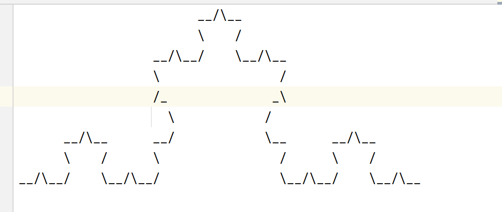

# Problem 2-1

## Code

(1) basic
```c++
#include <bits/stdc++.h>

using namespace std;

int solve(int n) {
    // when the snowflake is in its base shape
    // it is a triangle. therefore, return 3.
    if (n == 0) return 3;
    // otherwise, each edge can be partitioned into four parts
    return 4 * solve(n - 1);
}

int main() {
    int n;
    scanf("%d", &n);
    printf("%d\n", solve(n));
}
```

(2) medium
```c++
#include<bits/stdc++.h>

using namespace std;

char mp[3000][14000];
int x, y;  // initial position
int maxx, maxy;
// maximum row, maximum column

#define print(i, j, ch) ((mp[i][(j)]!='_'&&mp[i][j]!=' ')?:mp[i][j]=ch)


void solve(int n, int di) {
    // number and direction
    if (n == 0) {
        switch (di) {
            case 0:
                print(x, y, '_');
                ++y;
                print(x, y, '_');
                ++y;
                break;
            case 1:
                ++x;
                print(x, y, '\\');
                ++y;
                break;
            case 2:
                ++x, --y;
                print(x, y, '/');
                break;
            case 3:
                --y;
                print(x, y, '_');  // this or the next '_' will be overwritten
                --y;
                print(x, y, '_');
                break;
            case 4:
                --y;
                print(x, y, '\\');
                --x;
                break;
            case 5:
                print(x, y, '/');
                --x, ++y;
                break;
        }
        maxx = max(maxx, x);
        maxy = max(maxy, y);
        return;
    }
    solve(n - 1, di);
    solve(n - 1, (di + 5) % 6);
    solve(n - 1, (di + 1) % 6);
    solve(n - 1, di);
}

int main() {
    int n;
    scanf("%d", &n);
    // print the picture into a file(since the terminal cannot display such large picture well)
    freopen("out.txt", "w", stdout);
    // calculate the initial x position
    if (n > 1) {
        int tmp = n;
        x = 1;
        while (tmp > 1) {
            tmp--;
            x *= 3;
        }
        x--;
    }
    memset(mp, ' ', sizeof(mp));
    solve(n, 0);
    for (int i = 0; i <= maxx; ++i) {
        for (int j = 0; j <= maxy; ++j) {
            cout << mp[i][j];
        }
        cout << endl;
    }
}
```

(3) advanced

```c++

#include<bits/stdc++.h>

using namespace std;

char mp[14000][14000];
int x, y;  // initial position
int maxx, maxy;
// maximum row, maximum column

#define print(i, j, ch) ((mp[i][(j)]!='_'&&mp[i][j]!=' ')?:mp[i][j]=ch)


void solve(int n, int di) {
    // number and direction
    if (n == 0) {
        switch (di) {
            case 0:
                print(x, y, '_');
                ++y;
                print(x, y, '_');
                ++y;
                break;
            case 1:
                ++x;
                print(x, y, '\\');
                ++y;
                break;
            case 2:
                ++x, --y;
                print(x, y, '/');
                break;
            case 3:
                --y;
                print(x, y, '_');  // this or the next '_' will be overwritten
                --y;
                print(x, y, '_');
                break;
            case 4:
                --y;
                print(x, y, '\\');
                --x;
                break;
            case 5:
                print(x, y, '/');
                --x, ++y;
                break;
        }
        maxx = max(maxx, x);
        maxy = max(maxy, y);
        return;
    }
    solve(n - 1, di);
    solve(n - 1, (di + 5) % 6);
    solve(n - 1, (di + 1) % 6);
    solve(n - 1, di);
}

int main() {
    int n;
    scanf("%d", &n);
    // print the picture into a file(since the terminal cannot display such large picture well)
    freopen("out.txt", "w", stdout);
    // calculate the initial x position
    if (n > 1) {
        int tmp = n;
        x = 1;
        while (tmp > 1) {
            tmp--;
            x *= 3;
        }
        x--;
    }
    memset(mp, ' ', sizeof(mp));
    solve(n, 0);
    solve(n, 2);
    solve(n, 4);
    for (int i = 0; i <= maxx; ++i) {
        for (int j = 0; j <= maxy; ++j) {
            cout << mp[i][j];
        }
        cout << endl;
    }
}
```

## Result

(1)basic


(2)medium

input: 3



(3)advanced

input: 3


## Algorithm description

This problem can obviously be completed by recursion. Because every time the snowflake becomes more complex, three new edges are generated on top of the original edge. Then we consider how to achieve it.

Because it involves plane drawing, and its pointer coordinates are difficult to locate, I thought of calling package functions or using python coding at the beginning. But then I thought that the offset of the pointer coordinates would shift with the ascii drawing. If the source and destination of each ascii code were analyzed, it can be proved that the coordinates can be adjusted every step to achieve a perfect closed loop.
We start the six directions upwards, rotate clockwise, and number them sequentially, which are 0, 1, 2, ..., 5.
Draw the possible sources and destinations of each direction as a table:

|  id   | direction  |  source   | destination  |
|  ----  | :----:  |  :---:   | :---:  |
| 0  | up |  right up / left down   | right down / left up  |
| 1  | right up |  right down / left up   | up / down  |
| 5  | left up |  up / down   | right up / left down  |
| 4  | left down |  left up   | up / down  |
| 3  | down |  left down / right up   | left up / right down  |
| 2  | right down |  up / down   | right up  |

Using the table, we obtain a relation between every ascii direction.

Now we set the up direction(no.0) to be "moving the pointer to the right space after drawing", which is, (x,y++).
Then we consider the no.1(since no.0 is the source of no.1): the pointer is already placed at the right position to draw '/'! Therefore, the pointer should be adjusted after it draw the ascii code. Now we consider another destination of no.0: no.4. The pointer should be adjusted so that we can place the ascii code: (++x,--y). Using the same method, we then obtain the adjustment of pointer in each step of drawing.


Now we can construct the recursion function. Note that, we begin from no.0 position, and divide the line into four parts each time. The first part is the same direction but scale minus one, so as the fourth part. The second part is rotate the original position for 60 degree. The third part is 120 degree. When n==0, we arrive at the primitive triangle. Just draw the ascii code now.

Time complexity: 
basic:$O(n)$
medium:$O(4^n)$
advanced:$O(4^n)$

for medium and advanced: each time we divide the task into four tasks that the size is just smaller for 1.
Using the master theorem, we can obtain the time complexity, which is very high.

To decrease the time complexity, we can consider **Memory search**, that is, store the graph obtain after each time we draw one.
If the method for cutting edge is used well, it can at least reduce the time complexity into $O(3^n)$.

# Problem 2-2

## Code

```c++
#include<bits/stdc++.h>

using namespace std;
const int maxn = 22;

struct AVL {
    int tot; // total number of nodes
    struct _node {
        int val; // value it stores
        int bal; // balance value, left - right
        int lson, rson; // the id of its left child and right child
        int h; // height

        _node(int Val = 0, int Bal = 0, int Lson = 0, int Rson = 0, int H = 0) {
            val = Val;
            bal = Bal;
            lson = Lson;
            rson = Rson;
            h = H;
        }
    } node[maxn];

    void init(int n) {
        tot = 0;
        node[0].h = -1; // initialize the height to -1(empty tree)
    }

    void leftrotate(int u) {
        // left rotate
        // swap the root and its right child
        // note that 'u' is still the id of the root after the swapping
        int rson = node[u].rson;
        _node tmp = node[u];
        node[u].lson = rson;
        node[u].rson = node[rson].rson;
        node[u].val = node[rson].val;

        node[rson].val = tmp.val;
        node[rson].lson = tmp.lson;
        node[rson].rson = node[rson].lson;

        node[rson].h = max(node[node[rson].lson].h, node[node[rson].rson].h) + 1;
        node[u].h = max(node[node[u].lson].h, node[node[u].rson].h) + 1;
    }

    void rightrotate(int u) {
        // right rotate
        // swap the root and the left child
        int lson = node[u].lson; // the id of left child
        _node tmp = node[u]; // temporary information for swapping
        node[u].lson = node[lson].lson;
        node[u].rson = lson;
        node[u].val = node[lson].val;

        node[lson].lson = node[lson].rson;
        node[lson].rson = tmp.rson;
        node[lson].val = tmp.val;

        node[lson].h = max(node[node[lson].lson].h, node[node[lson].rson].h) + 1;
        node[u].h = max(node[node[u].lson].h, node[node[u].rson].h) + 1;
    }

    void balance(int u) {
        node[u].h = max(node[node[u].lson].h, node[node[u].rson].h) + 1;
        node[u].bal = node[node[u].lson].h - node[node[u].rson].h;

        if (node[u].bal > 1) {
            // left subtree is heavier
            if (node[node[u].lson].bal > 0) {
                // LL
                rightrotate(u);
            } else {
                // LR
                leftrotate(node[u].lson);
                rightrotate(u);
            }
        }
        if (node[u].bal < -1) {
            // right subtree is heavier
            if (node[node[u].rson].bal <= 0) {
                // RR
                leftrotate(u);
            } else {
                // RL
                rightrotate(node[u].rson);
                leftrotate(u);
            }
        }
    }

    void dfs(int u, int opt) {
        // depth first search
        // opt==1: print the value
        // opt==0: print the balance value
        if (node[u].lson) dfs(node[u].lson, opt);
        if (opt) printf("%d ", node[u].val);
        else printf("%d ", node[node[u].lson].h - node[node[u].rson].h);
        if (node[u].rson) dfs(node[u].rson, opt);
    }

    void insert(int u, int val) {
        if (!node[1].val) {
            // build tree
            node[++tot] = _node(val, 0, 0, 0, 0);
            return;
        }
        if (node[u].val == val) {
            return;
        } else if (node[u].val > val) {
            if (node[u].lson) insert(node[u].lson, val);
            else {
                // if the left child doesn't exist
                // create one new node
                node[u].lson = ++tot;
                node[tot] = _node(val, 0, 0, 0, 0);
            }
        } else {
            if (node[u].rson) insert(node[u].rson, val);
            else {
                node[u].rson = ++tot;
                node[tot] = _node(val, 0, 0, 0, 0);
            }
        }
        // trace back
        balance(u);
    }
};

int main() {
    int n;
    printf("please input the sum of node:");
    scanf("%d", &n);
    AVL tree;
    tree.init(n);

    printf("please input the value of node:");
    for (int i = 1; i <= n; ++i) {
        int tmp;
        scanf("%d", &tmp);
        tree.insert(1, tmp);
    }
    printf("the inorder tra is: ");
    tree.dfs(1, 1);
    printf("\nthe bf(balance flag) of each node: ");
    tree.dfs(1, 0);
    printf("\nAVL Tree has been successfully constructed!\n");
}
```

## Result


## Algorithm description

The AVL tree is a classic balance tree. It maintains balance by recording a balance parameter and adjusting the first subtree whose parameters are destroyed during the backtracking process. There is mainly a rotation operation, the basic idea is to swap father and son.

The algorithm is not complicated, but its constant is relatively large. In general engineering, red-black trees are used, an upgraded version of AVL tree. In algorithm competitions, treap and splay trees with short code and easy to write and tend to be used. Among them, the non-rotating treap has strong plasticity and can be used for persistent data structures.

The main operations of the balanced tree: insertion and deletion, both have the excellent performance of $O(log n)$. It can prevent the degradation of the binary search tree.
In my code, I did not use the most common convenient pointer to write AVL, but used an array implementation. This method can improve fault tolerance and security, but the disadvantage is that the memory allocation is rigid and not flexible enough.

Time complexity: 
insertion: $O(log n)$

Since every time we search through the tree to insert one node. The height of the tree is $O(log n)$. Therefore, each searching takes $O(log n)$ time to locate the position. Note that the rotation function only takes constant time.


## Other solutions

We can also use a treap without rotation.

Treap tree is a combination of binary sort tree and heap. It has two properties at the same time. These two properties determine a unique treap. Since the priority value of the heap is randomly generated, treap is theoretically a balanced tree. The non-rotating treap is easy to write, and supports maintenance sequence, durability and other features.

The basic operations are split and merge. To insert a node, we split the tree into two trees, the left tree has smaller value while the right tree has larger. Then we can merge the new node into the tree and merge the two trees together to obtain a new tree. The merge operation is to maintain the feature that the binary search tree is also a heap.

The time complexity of split, merge and find is all $O(log n)$. The insertion operation, invoking the three, also has the time complexity of $O(log n)$.
```c++

#include<bits/stdc++.h>

using namespace std;

struct Treap {

    struct node {
        int key;
        int priority;
        struct node *lch, *rch;

        node(int i) {
            key = i;
            priority = rand();
            lch = nullptr;
            rch = nullptr;
        }
    };

    node *root = nullptr;

    // split the tree into two trees according to the given key
    // nodes on the left tree has smaller value than key
    // while nodes on the right has larger
    // split function uses recursion
    pair<node *, node *> split(node *u, int key) {
        if (u == nullptr)
            return make_pair(nullptr, nullptr);
        if (key < u->key) {
            pair<node *, node *> o = split(u->lch, key);
            u->lch = o.second;
            return make_pair(o.first, u);
        } else {
            pair<node *, node *> o = split(u->rch, key);
            u->rch = o.first;
            return make_pair(u, o.second);
        }
    }

    // merge two trees into one
    // the u has smaller value than v's
    node *merge(node *u,node *v) {
        if (u == nullptr) return v;
        if (v == nullptr) return u;
        // maintain the heap feature
        if (u->priority > v->priority) {
            u->rch = merge(u->rch, v);
            return u;
        } else {
            v->lch = merge(u, v->lch);
            return v;
        }
    }

    // find a key in the tree
    int find(node *u, int key) {
        if (u == nullptr) return 0;
        if (key == u->key) return 1;
        if (key < u->key) return find(u->lch, key);
        else return find(u->rch, key);
    }

    // insert a key
    void insert(int key) {
        // first we split the tree according to the key
        // and make them into a pair
        pair<node *, node *> o = split(root, key);
        if (find(root, key) == 0) // if no such node, create and merge
            o.first = merge(o.first, new node(key));
        // merge the two trees
        root = merge(o.first, o.second);
    }

    void dfs(node *u) {
        if (u == nullptr) return;
        dfs(u->lch);
        printf("%d ", u->key);
        dfs(u->rch);
    }

    void inorder_display() {
        dfs(root);
    }
};


int main() {
    srand(time(NULL));
    int n;
    printf("please input the sum of node:");
    scanf("%d", &n);
    Treap tree;

    printf("please input the value of node:");
    for (int i = 1; i <= n; ++i) {
        int tmp;
        scanf("%d", &tmp);
        tree.insert(tmp);
    }
    printf("the inorder tra is: ");
    tree.inorder_display();
    printf("\nTreap Tree has been successfully constructed!\n");
}
```