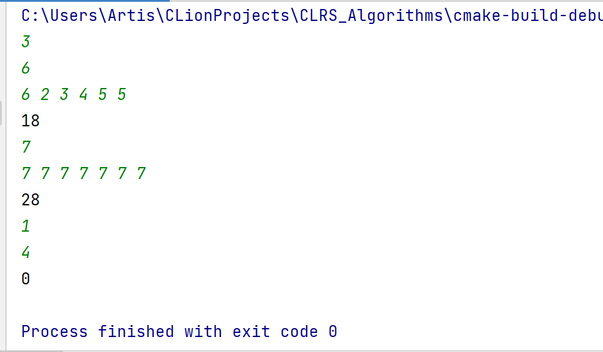
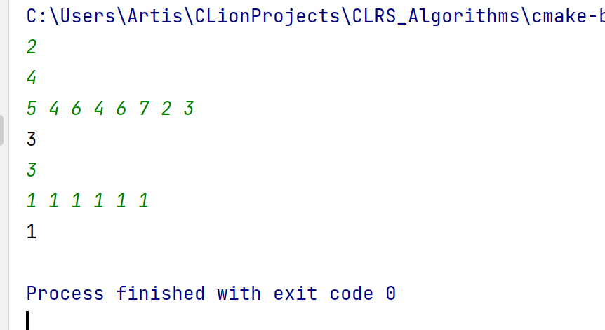

# Problem 3-1 Stone Game

## Code

solution 1 (basic)
```c++
#include<bits/stdc++.h>

using namespace std;
const int maxn = 504;
typedef long long ll;
#define fo(i, a, b) for(int i=(a);i<=(b);++i)
int sto[maxn];
ll dp[maxn][maxn];
ll sum[maxn];
// 由于该算法for循环较多，为了使代码简洁明了，使用了宏定义
// 将for循环用fo表示
// dp代表区间为[i,j]的答案. sum代表前缀和.

void solve() {
    int n;
    scanf("%d", &n);
    fo(i, 1, n) {
        scanf("%d", &sto[i]);
        sum[i] = sum[i - 1] + sto[i];
    }
    fo(i, 1, n) fo(j, 1, n) dp[i][j] = 0; // 初始化
    fo(len, 1, n - 1) fo(i, 1, n - len) {
        int j = i + len;
        // 先枚举区间长度,再枚举起始点i
        fo(k, i, j - 1) {
            // 枚举分界点
            // a[i]~a[k],a[k+1]~a[j]
            ll leftsum = sum[k] - sum[i - 1];
            ll rightsum = sum[j] - sum[k];
            // 模拟题目给的得分流程
            if (leftsum > rightsum)
                dp[i][j] = max(dp[i][j], rightsum + dp[k + 1][j]);
            else if (leftsum < rightsum)
                dp[i][j] = max(dp[i][j], leftsum + dp[i][k]);
            else
                dp[i][j] = max({dp[i][j], leftsum + dp[i][k],\
                rightsum + dp[k + 1][j]});
        }
    }
    // 答案为dp[1][n]
    printf("%lld\n", dp[1][n]);
}

int main() {
    int t;
    scanf("%d", &t);  // 多次输入
    while (t--) solve();
}
```
solution 2 (medium)
```c++
#include<bits/stdc++.h>

using namespace std;
const int maxn = 504;
typedef long long ll;
#define fo(i, a, b) for(int i=(a);i<=(b);++i)
int sto[maxn];
ll sum[maxn];
int g[maxn][maxn];
ll lef[maxn][maxn], rig[maxn][maxn];
// dp为答案;sum记录前缀和;g记录区间[i,j]的分界点位置
// lef记录从某一特定i开始,[i,j]答案的最大值
// rig记录从某一特定j开始,[i,j]答案的最大值(与dp数组相互补充,
// 为后续更新dp作优化准备)

void solve() {
    int n;
    scanf("%d", &n);
    for (int i = 1; i <= n; ++i) {
        scanf("%d", &sto[i]);
        sum[i] = sum[i - 1] + sto[i];
    }
    // 初始化
    ll dp;
    fo(i, 1, n) fo(j, 1, n) dp = 0, g[i][j] = 0, lef[i][j] = 0, rig[i][j] = 0;
    // 预处理g数组,即区间[i,j]的分界点位置.
    // 使用队列,因为g[i,j]具有单调性,可以将复杂度均摊为O(n^2)
    queue<int> q;
    fo(i, 1, n) {
        while (!q.empty()) q.pop();
        q.push(i);
        fo(j, i + 1, n) {
            q.push(j);
            g[i][j] = g[i][j - 1];
            // 利用了前缀和
            while ((sum[q.front()] - sum[i - 1]) * 2 <= sum[j] - sum[i - 1]) {
                g[i][j] = q.front();
                q.pop();
            }
            // g[i][j]为最后一个小于等于[i,j]区间和的一半的下标位置
        }
    }
    // 自底向上dp,枚举区间长度,再枚举区间起点i
    fo(len, 1, n - 1) fo(i, 1, n - len) {
            lef[i][i] = rig[i][i] = sto[i];
            int j = i + len;
            int mid = g[i][j];
            dp = 0;
            // 若该值介于i,j之中,则可以更新
            if (i <= mid)
                dp = max(dp, lef[i][mid]);
            if (mid + 2 <= j)
                dp = max(dp, rig[mid + 2][j]);
            // 若左右两个部分长度相等,特判,再次更新
            if ((sum[mid] - sum[i - 1]) * 2 == sum[j] - sum[i - 1])
                dp = max(dp, rig[mid + 1][j]);
            // 与dp数组并行处理,为dp数组的计算提供优化
            lef[i][j] = max(lef[i][j - 1], sum[j] - sum[i - 1] + dp);
            rig[i][j] = max(rig[i + 1][j], sum[j] - sum[i - 1] + dp);
        }

    printf("%lld\n", dp);
}


int main() {
    int t;
    scanf("%d", &t);
    while (t--) solve();
}
```

## Result

The first integer: three test samples.



## Algorithm description
- Define sub-problems

This is a typical interval dp problem. For this type of problem, it is easy to think of using a smaller interval to update the larger interval in order to obtain the optimal solution of the overall interval. Therefore, the sub-problem is the smaller interval within the current interval.

- Define the optimal-value array

Since the interval dp is updated from the inter-cell to the large interval, it is natural to think that a state is set for each continuous interval, which is $dp[i][j]$.

$i$ and $j$ respectively represent the start and end points of the interval. $dp[i][j]$ represents the answer of the interval.
  
- How to calculate optimal-values

From the description of the problem, the answer to an interval can be derived from some left half or some right half of it. Therefore, the most natural idea is to enumerate the turning points in each interval. Then update the interval from the left and right intervals divided by the transit point.
Therefore, we can first write a n^3 solution. That is, enumerate the intervals from the bottom up, and the large intervals are updated from the enumerated smaller ones.
That is,
$$dp[i][j]=max\{dp[i][j],dp[i][k]+\sum_{a=l}^k stone\[a]\},\sum_{a=l}^k stone\[a]<\sum_{a=k+1}^r stone\[a]$$
$$dp[i][j]=max\{dp[i][j],dp[k][j]+\sum_{a=k}^j stone\[a]\},\sum_{a=l}^k stone\[a]>\sum_{a=k+1}^r stone\[a]$$

Note that for an interval, a conditional judgment is required so that the intermediate position of the decision change is uniquely determined. Therefore, we consider whether the intermediate position can be preprocessed.
At the same time, observing the cycle, we found that when the middle position of the decision change and the answer between the cells are known, the third cycle of the current interval, that is, the process of enumerating the demarcation points is actually a monotonous process.
Why do we say that? Look at this statement in detail:
`dp[i][j] = max(dp[i][j], rightsum + dp[k + 1][j]);`. The `max{rightsum + dp[k+1][j]}` can be calculated for a fixed $j$ in $O(n)$. Let's take a look at this part of the convolution. It can actually be maintained by enumerating a $j$ and then traversing $i$. The main basis is that the `max` function has repeated collinearity. 

Therefore, we consider processing the $dp$ array and maintain an array with $i$ as the starting point and convolving the left part and taking $j$ as the starting point and convolving the right part of the array, that is, three arrays, at the same time. We name the latter two as $left\[i]\[j]$ and $right\[i]\[j]$.
Because the calculation of `left` and `right` requires a `dp` value of one smaller level interval; and the calculation of the `dp` value of the current level requires preprocessed `left` and `right`. We interspersed the updates of these three arrays at the same time.
Therefore, we have:

$$lef[i][j] = max\{lef[i][j - 1], \sum_{a=i}^j stone[a] + dp[i][j]\}$$
$$rig[i][j] = max\{rig[i + 1][j], \sum_{a=i}^j stone[a] + dp[i][j]\}$$
$$dp[i][j] = max\{dp[i][j], lef[i][mid]\}$$
$$dp[i][j] = max\{dp[i][j], rig[mid + 2][j]\}$$

Where $mid$ represents the intermediate position that change the decision, which is processed in advance according to its linearity.

- Recover the optimal solution 

The optimal solution is $dp[1][n]$.
If we want to recover the detail of the optimal solution, we can add a traceability array to record in which decision we obtain a better result.
After printing the array, we can obtain the detail of the optimal solution.

- time complexity

In the basic solution, we traverse all intervals, and enumerate the cutting point inside the interval. The time complexity is obviously $O(n^3)$. The space complexity, as for storing the `dp` value, is $O(n^2)$.

In the medium solution, we use two `for` loop. Since the calculation of `g` has linearity, we have amortized time complexity of $O(n^2)$. The space complexity, as for storing the `left`, `right` and `g` value, is $O(n^2)$.


# Problem 3-2 Russian-doll envelope problem

## Code
solution 1 (basic)
```c++
#include<bits/stdc++.h>

using namespace std;
const int maxn = 5e3 + 3;
vector<pair<int, int> > eve; // 信封(发现拼错了..)
#define h second
#define w first
int dp[maxn]; // 遍历到第i个,答案

// 重载比较函数,用于排序
bool cmp(pair<int, int> a, pair<int, int> b) {
    if (a.w == b.w) return a.h < b.h;
    else return a.w < b.w;
}

void solve() {
    int n;
    scanf("%d", &n);
    // 初始化
    eve.clear();
    for (int i = 0; i < n; ++i) dp[i] = 0;
    for (int i = 1, w, h; i <= n; ++i) scanf("%d%d", &w, &h), eve.push_back(make_pair(w, h));
    sort(eve.begin(), eve.end(), cmp);
    for (int i = 0; i < n; ++i)
        for (int j = 0; j < i; ++j)
            if (eve[j].w < eve[i].w && eve[j].h < eve[i].h)
                dp[i] = max(dp[i], dp[j] + 1);
    int ans = 0;
    for (int i = 0; i < n; ++i) ans = max(dp[i], ans);
    printf("%d\n", ans + 1);
}

int main() {
    int t;
    scanf("%d", &t);
    while (t--) solve();
}
```
solution 2 (medium)

```c++
#include<bits/stdc++.h>
// 看成LIS问题
using namespace std;
const int maxn = 5e3 + 3;
vector<pair<int, int> > eve; // 信封
#define h second
#define w first
#define all(x) x.begin(),x.end()

// 重载比较函数
bool cmp(pair<int, int> a, pair<int, int> b) {
    if (a.w == b.w) return a.h < b.h;
    else return a.w < b.w;
}

void solve() {
    int n;
    scanf("%d", &n);
    // 初始化
    eve.clear();
    // 将dp数组初始化为都是infinite,便于编码(lower_bound二分查找)
    vector<pair<int, int> > dp(maxn, make_pair(1 << 30, 1 << 30));
    for (int i = 1, w, h; i <= n; ++i) scanf("%d%d", &w, &h), eve.push_back(make_pair(w, h));
    sort(all(eve), cmp); // 排序
    for (int i = 0; i < n; ++i) {
        // 二分查找
        int pos = lower_bound(all(dp), eve[i], cmp) - dp.begin();
        if (pos && (dp[pos - 1].w == eve[i].w || dp[pos - 1].h == eve[i].h)) continue; 
        // 如果高度或宽度等于上一个,上一个肯定更优,不加入
        dp[pos] = eve[i]; // 不然,加入
    }

    // 答案即为dp数组有效值的长度
    printf("%d\n", lower_bound(all(dp), make_pair(1 << 30, 1 << 30)) - dp.begin());
}

int main() {
    int t;
    scanf("%d", &t);
    while (t--) solve();
}
```
solution 3 (Binary Index Tree)

```c++
#include<bits/stdc++.h>
// 树状数组(BIT)优化:二位偏序
using namespace std;
const int maxn = 5e3 + 3;
vector<pair<int, int> > eve; // 信封
#define h second
#define w first
#define lowbit(x) ((x)&-(x)) // 树状数组的操作
int tree[maxn]; // 树状数组
int n;

bool cmp(pair<int, int> a, pair<int, int> b) {
    if (a.w == b.w) return a.h < b.h;
    else return a.w < b.w;
}

// 更新树状数组
void add(int x, int d) {
    while (x <= n) {
        tree[x] = max(tree[x], d);
        x += lowbit(x);
    }
}

// 查询
int query(int x) {
    int maxx = 0;
    while (x > 0) {
        maxx = max(maxx, tree[x]);
        x -= lowbit(x);
    }
    return maxx;
}

void solve() {
    scanf("%d", &n);
    // 初始化
    eve.clear();
    for (int i = 0; i <= n; ++i) tree[i] = 0;
    for (int i = 1, w, h; i <= n; ++i) scanf("%d%d", &w, &h), eve.push_back(make_pair(w, h));
    sort(eve.begin(), eve.end(), cmp); // 用第一维属性排序
    int ans = 0, cur;
    // 由于该题要求高和宽严格大于,因此要把树状数组的更新分层.
    // 不能直接把序号顺序看作递增的第一维特征
    queue<pair<int, int> > q;
    // 队列暂存同一层(宽相同)的数,均摊时间复杂度O(nlgn)
    for (int i = 0; i < eve.size(); ++i) { // 比当前宽度小
        if (i != 0 && eve[i].w != eve[i - 1].w)
            while (!q.empty()) { // 处理一维的数据
                add(q.front().first, q.front().second);
                q.pop();
            }
        cur = query(eve[i].h - 1);   // 查询比当前高度小的数目
        cur++;
        q.push(make_pair(eve[i].h, cur)); // 待更新
        ans = max(ans, cur);
    }

    printf("%d\n", ans);
}

int main() {
    int t;
    scanf("%d", &t);
    while (t--) solve();
}
```
## Result

The first integer: two test samples.


## Algorithm description
- Define sub-problems

First of all, we can regard this problem as the longest increasing subsequence problem. Sort the data by width, and the increase in the sequence index after sorting means the increase in width. Think of the length as the value at each position. This problem is abstracted into the longest increasing subsequence problem. (In fact, it can be more abstract, which will be expanded in detail in **other solution** part).

Therefore, the sub-problem is obvious. To get the length of the longest sequence containing the number of the current position, we traverse the position before the current position, and if the previous position satisfies the value less than the current position, update the answer at the current position.

- Define the optimal-value array

`dp` represents the length of the longest subsequence when we take the $i$th number as the last number of the increasing subsequence.

- How to calculate optimal-values

Sort the envelopes by width, and treat the width as a subscript. Then traverse the array from left to right, and for each position, find the dp value of the previous position whose value is less than its position, and update it.
That is:
$$dp[i] = max\{dp[j]+1\},j<i and a[j]<a[i]$$

In the medium solution, we consider optimizing this dynamic programming. Consider a greedy strategy, which is to maintain a queue. Replace the current element with the element in the queue whose height is just greater than it. The length of the final queue is the answer. The basic idea is that the longest increasing sub-sequence must be the last bit as small as possible, so that more numbers can be connected in the future. For the currently considered subscript, the subscripts of all elements in the queue must be smaller than the current subscript. For future subscripts, the current subscript must be smaller. Therefore, only the contribution to the future is considered, and the width of the current element can be ignored. The purpose of this queue is to maintain multiple feasible solutions at the same time, and use greedy thinking to maximize future results.
At the same time, the queue elements are monotonic, and we can use binary search to quickly find replaceable positions.

- Recover the optimal solution

The optimal solution is $dp[n]$ or in the basic requirement, the length of the queue.
To obtain the detail solution, we cannot use the medium solution's algorithm. We can only modify the basic solution to add an array to record the content of the longest increasing subsequence(of course, the envelope).

- time complexity

The time complexity of the basic algorithm is $O(n^2)$ since we need to go through all elements that are in front of the current considered one.

The space complexity of the algorithms is $O(n)$ to record the array.

The time complexity of the medium algorithm is $O(nlog n)$ since we use binary search.

## Other solutions

### Binary Index Tree

In fact, this problem can be abstracted into a simple two-dimensional partial order problem.

To solve the problem of two-dimensional partial order, we often use divide-and-conquer or binary index tree, a concise and efficient data structure.

First of all, why is this question a two-dimensional partial order? In fact, we can see it when we abstract it as a LIS problem. Each element has two attributes, length and width. Take the first attribute of the element as the subscript or time, and follow this sorting order. For each time, use the second attribute as the axis to divide the historical time data and divide it into two halves. That is, the second attribute is greater than it and less than its. With this data, we can update the answer.

Now let's briefly introduce the binary index tree. Binary index tree is a derived data structure of the line segment tree. Whatever it can achieve, the line segment tree can also achieve. However, the code of BIT is very simple and elegant. Behind this is its use of the principle of binary numbers.

Note that this problem requires that the first attribute is also strictly less. Therefore, if we put two elements with the same width directly into the adjacent but increasing timeline, the relationship between them will be destroyed. So consider dividing the element segment into different levels by width. After updating the elements of equal width, consider putting them into the BIT to update the answer of the element with larger width.

Using a queue to temporarily store elements of one dimension has an amortized O(n) complexity.

The total complexity is $O(n lg n)$.
