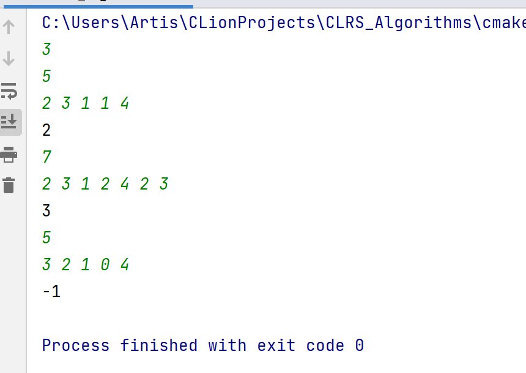
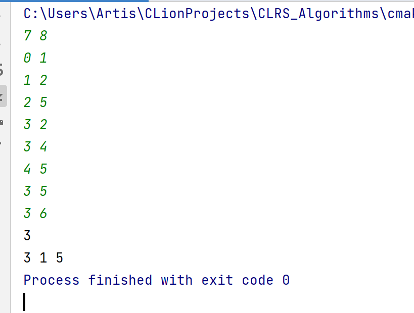
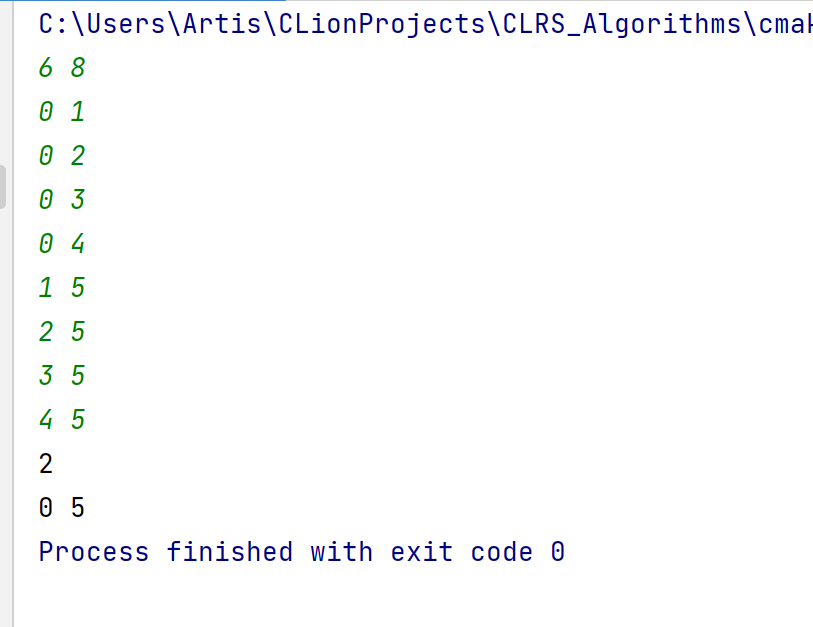
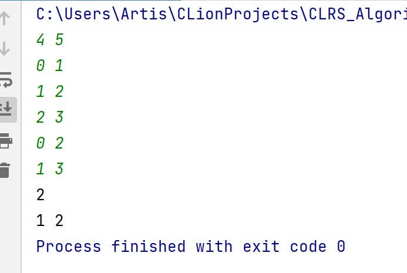
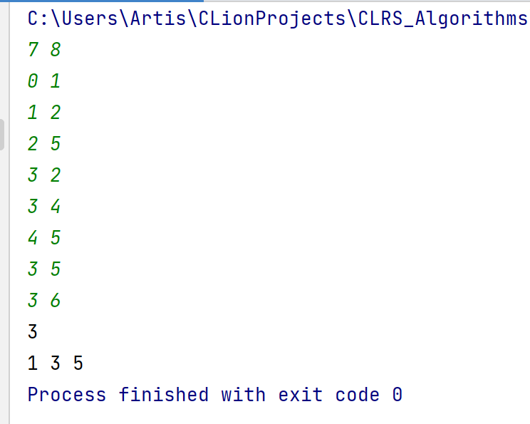
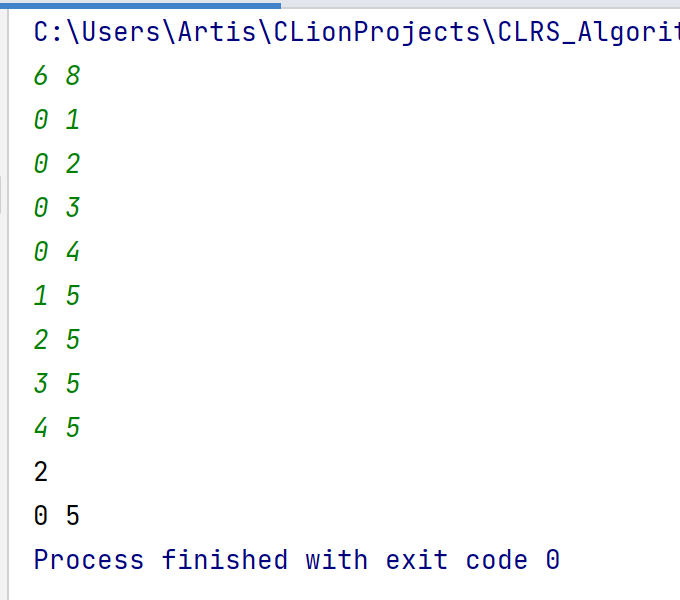
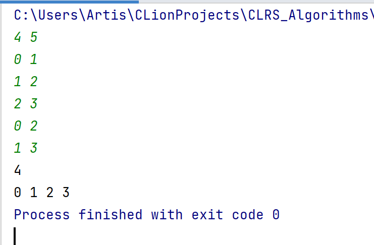
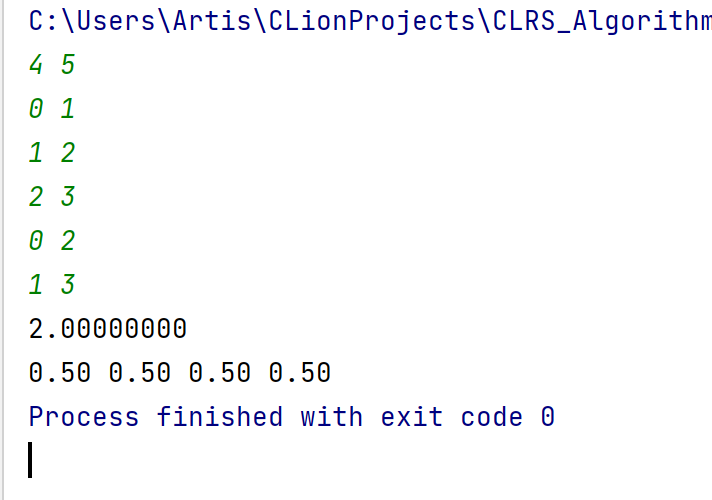
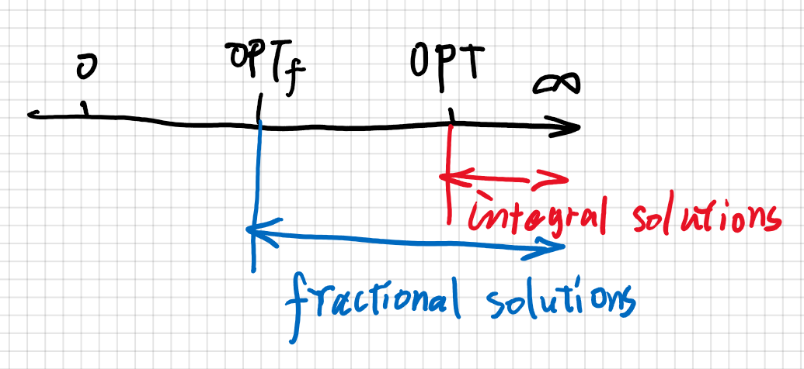

# Problem 4-1 Jump Game

## Code

solution 1 (dynamic programming)

```c++
#include<bits/stdc++.h>

using namespace std;
#define fast std::ios_base::sync_with_stdio(false);cin.tie(0);cout.tie(0);
// 加速cin和cout
const int inf = 0x7f7f7f7f; // 无穷

int main() {
    fast;
    int t;
    cin >> t;
    while (t--) {
        int n;
        cin >> n;
        vector<int> a(n);
        vector<int> dp(n, inf); // 最少的数目能到这个位置,初始化为无穷
        for (auto &i:a) cin >> i; // 输入
        dp[0] = 0; // base case
        for (int i = 0; i < n; ++i) {
            for (int j = 1; j <= a[i]; ++j) { // 遍历后面能抵达的位置
                if (i + j >= n) break;
                dp[i + j] = min(dp[i + j], dp[i] + 1); // 向后更新
            }
        }
        if (dp[n - 1] != inf) cout << dp[n - 1] << endl;
        else cout << -1 << endl;  // 如果不能抵达
    }
}
```

solution 2 (greedy)

```c++
#include<bits/stdc++.h>

using namespace std;

#define fast std::ios_base::sync_with_stdio(false);cin.tie(0);cout.tie(0);
// 加速cin和cout

int main() {
    fast;
    int t; // multiple test cases
    cin >> t;
    while (t--) {
        int n;
        cin >> n;
        vector<int> a(n);  // 数组
        for (auto &i:a) cin >> i; // 输入
        int dp = 0;
        for (int i = 0;;) {   // 循环
            int nxt = 0, mx = 0; // 下一个位置;可以走最远的距离
            if (i == n - 1) break;  // 如果已经走到了目的地,break
            if (a[i] == 0) {  // 如果当前位置不能走,说明无法抵达,break
                dp = -1;
                break;
            }
            //  贪心地选择当前能抵达的位置中,能走的最远的位置,作为下一个位置
            for (int j = 1; j <= a[i]; ++j) {
                if (i + j >= n) break;
                if (a[i + j] + i + j > mx) nxt = i + j, mx = a[i + j] + i + j;
            }
            dp++; // 步数
            i = nxt; // 更新位置
        }
        cout << dp << endl;
    }
}
```

## Result



The first number is the number of test cases.
For each test case, there are two lines. The first line consists of one number $n$, representing the number of positions.
The second line consists of $n$ elements, the $i$th number represents the number of positions that are reachable from the current position.

## Algorithm description

It is natural to think of dynamic programming.
Status: $dp[i]$ represents the minimum number of steps to position $i$. Initialize to positive infinity.
State transition: for $j$ in range$(1,a[i])$ $dp[i+j] = min(dp[i+j],dp[i]+1)$.
That is, the answer is updated from front to back.
base case: $dp[0]=0$. That is, the initial position.
Answer: $dp[n-1]$. That is, the cost to the final position.
Time complexity: $O(n^2)$. Since we need to iterate the whole array, and for each position, update its reachable positions' dp value.

The greedy approach is based on the following principle: every time you jump, it is optimal to jump to the position of "you can jump to the farthest position from here".
It is not difficult to prove that for the same jump cost, if one jump can get to a position that can reach farther position, it is more likely to reach the destination with the least number of jumping times.
So every time it finds the position that can jump to the farthest position among all the positions that can be reached by the current position.
Time complexity: $O(n^2)$. Since we need to find the optimal position among reachable positions.


# Problem 3-2 Russian-doll envelope problem

## Code
solution 1 (greedy)
```c++
#include<bits/stdc++.h>

using namespace std;

// 快速读入,用于减小复杂度常数
inline int read() {
    int x = 0, f = 1;
    char ch = getchar();
    for (; !isdigit(ch); ch = getchar())if (ch == '-')f = -1;
    for (; isdigit(ch); ch = getchar())x = x * 10 + ch - '0';
    return x * f;
}

int n, m;
int adj[103][103]; // 邻接矩阵存图

int main() {
    n = read(), m = read();
    for (int i = 1; i <= m; ++i) {
        int u = read(), v = read();
        u++, v++; // 程序中以1开始编号
        adj[u][v] = adj[v][u] = 1;
    }
    int res = 0;
    vector<int> ans;  // 用来储存feasible solution的点集
    while (1) {
        // 每个点的度数, 最大度数的点的度数, 最大度数的点的编号
        int d[104], mx = 0, id;
        for (int i = 1; i <= n; ++i) d[i] = 0; // 清空
        for (int i = 1; i <= n; ++i) {
            for (int j = 1; j <= n; ++j) {
                if (adj[i][j]) d[i]++; // 对每个点计算剩余图的度数
            }
            if (d[i] > mx) id = i, mx = d[i];
        }
        if (mx == 0) break; // 如果图已空
        res++; // 加入该点
        ans.push_back(id);
        for (int i = 1; i <= n; ++i)  // 删掉该点连接的边
            if (adj[id][i] == 1) adj[i][id] = adj[id][i] = 0;
    }
    printf("%d\n", res);
    for (auto i:ans) printf("%d ", i - 1);
    return 0;
}

```
solution 2 (linear programming)

```c++
#include<bits/stdc++.h>

using namespace std;

// 快读,用于卡常
inline int read() {
    int x = 0, f = 1;
    char ch = getchar();
    for (; !isdigit(ch); ch = getchar())if (ch == '-')f = -1;
    for (; isdigit(ch); ch = getchar())x = x * 10 + ch - '0';
    return x * f;
}

const int N = 1002;
const double eps = 1e-8; // 控制精度
double a[N][N], ans[N]; // 储存simplex矩阵, 储存答案
int B[N << 1], n, m; // 储存轴位置

void Pivot(int l, int e) {
    swap(B[n + l], B[e]); // 交换基本变量(n+l)与非基本变量(e)
    double t = a[l][e];
    a[l][e] = 1;
    for (int j = 0; j <= n; ++j) a[l][j] /= t;
    for (int i = 0; i <= m; ++i)
        if (i != l && abs(a[i][e]) > eps) {
            t = a[i][e]; // t表示系数
            a[i][e] = 0;
            for (int j = 0; j <= n; ++j) a[i][j] -= t * a[l][j];
            // 消去非基变量
        }
}

bool Simplex() {
    while (true) {
        int l = 0, e = 0;
        double mn = 1e18;
        for (int j = 1; j <= n; ++j)
            if (a[0][j] > eps) {
                e = j;
                break;
            }
        if (!e) return true;
        for (int i = 1; i <= m; ++i)
            if (a[i][e] > eps && a[i][0] / a[i][e] < mn)
                mn = a[i][0] / a[i][e], l = i; // 找到约束最紧的
        if (!l) {
            puts("Unbounded");
            return false;
        }
        Pivot(l, e);
    }
}

bool init() {
    // 寻找初始化解
    while (true) {
        int e = 0, l = 0;
        for (int i = 1; i <= m; ++i)
            if (a[i][0] < -eps && (!l || (rand() & 1))) l = i;
        if (!l) return true;
        for (int j = 1; j <= n; ++j)
            if (a[l][j] < -eps && (!e || (rand() & 1))) e = j;
        if (!e) {
            puts("Infeasible");
            return false;
        }
        Pivot(l, e);
    }
}

void process() {
    n = read(), m = read();
    for (int i = 1; i <= m; ++i) {
        int u = read(), v = read();
        u++, v++;
        a[i][u] = -1; // m条约束,因为是求最小,为转化为标准型,取-1
        a[i][v] = -1;
    }
    for (int i = 1; i <= n; ++i) a[0][i] = -1; // 目标函数,参数取-1
    for (int i = 1; i <= m; ++i) a[i][0] = -1; // 约束条件的右边部分
}

int main() {
    process();
    for (int i = 1; i <= n; ++i) B[i] = i; // 储存轴的位置
    if (init() && Simplex()) {
        //printf("%.8lf\n",a[0][0]);
        for (int i = 1; i <= m; ++i) ans[B[i + n]] = a[i][0];
        //for(int i=1;i<=n;++i) printf("%.2lf ",ans[i]);
        int res = 0;
        vector<int> ress;
        // rounding approach: 最简单的四舍五入
        for (int i = 1; i <= n; ++i) if (round(ans[i]) == 1) res++, ress.push_back(i);
        printf("%d\n", res);
        for (auto i:ress) printf("%d ", i - 1);
    }
    return 0;
}

```

## Result

solution 1 (greedy)
- test case 1


  
- test case 2



- test case 3



solution 2 (linear programming)

- test case 1



- test case 2



- test case 3



comment:



## Algorithm description

The idea of the greedy algorithm is to find the point with the largest degree in the 
current remaining graph every time, and add this point to the answer. Then delete all edges adjacent to the point.
approximation factor: 2.
proof can be found in the teaching ppt slide.

The idea of Linear Programming is: observe the original problem and find that it is essentially a 01 integer programming problem.
The 01 integer programming problem is also an NP-hard problem. However, we can turn the original problem into fractional
linear programming problems to approximate the answer.
First consider converting the original question into a fractional version (this process is LP-relaxation
). For each vertex, there is a variable $x_i$,
$xi$ has a limitation of 0\leq x_i\leq 1. 
Consider that $x_i=1$ means selecting the vertex, while $x_i=0$ means not selecting.
When $xi$ is between $0$ and $1$, we consider that we "partially select" the vertex.
For each edge $(i, j)$, at least one of its two endpoints needs to be covered. We get
new restriction conditions $x_i+x_j\geq 1$. Our objective function is to minimize $\sum x_i$.

Using LP's classic algorithm `simplex` algorithm, we can solve this relaxed problem within polynomial time.
The next thing to consider is how to transform the answer of the feasible solution of fractional version into
legal solution of the original problem.



The idea is simple `rounding`: that is, we think that $\geq 0.5$ is $1$(pick), and $<0.5$ is $0$.
Next, we prove that this simple transformation idea can get a legal solution of the original problem.
Consider every constraint $x_i+x_j\geq 1$. Then there must be at least one $x$ greater than or equal to $0.5$.
In rounding, we set it to 1. Then for each edge after rounding at least one end vertex of it is selected.
Therefore, this transformation idea can get a legal solution of the original problem.

Next we prove that this algorithm is a factor $2$ approximation to vertex cover.
This is equivalent to proving that the vertex cover obtained by the algorithm is at most 2 times the optimal vertex cover.
Suppose that $OPT_{frac}$ is the optimal solution of the fractional version, and $OPT_{vc}$ is the size of the optimal cover.
First, we can get $OPT_{frac}\leq OPT_{vc}$. Because after relaxation, the result will be no worse than the optimal
 cover of integer version. Next, our solution is at most $2\times OPT_{frac}$. because
our approach is no worse than doubling and rounding down. Therefore, our solution costs at most $2\times OPT_{vc}$.

The following briefly explains the LPP process.
We write the question:
$$min x_1+x_2+...+x_n$$
s.t
$$x_v + x_u \geq 1$$for every edge(v,u)
Converted to standard type:
$$max (-1)*x_1+(-1)*x_2+...+(-1)*x_n$$
s.t
$$(-1)*x_v + (-1)*x_u \leq -1$$ for every edge(v,u)
Get the relaxed form:
$$max (-1)*x_1+(-1)*x_2+...+(-1)*x_n$$
s.t
$$(-1)*x_v + (-1)*x_u + x_{n+i}= -1$$ for every edge(v,u)
i in range(1,m)
Then you can get the coefficient matrix and run it with the simplex algorithm.