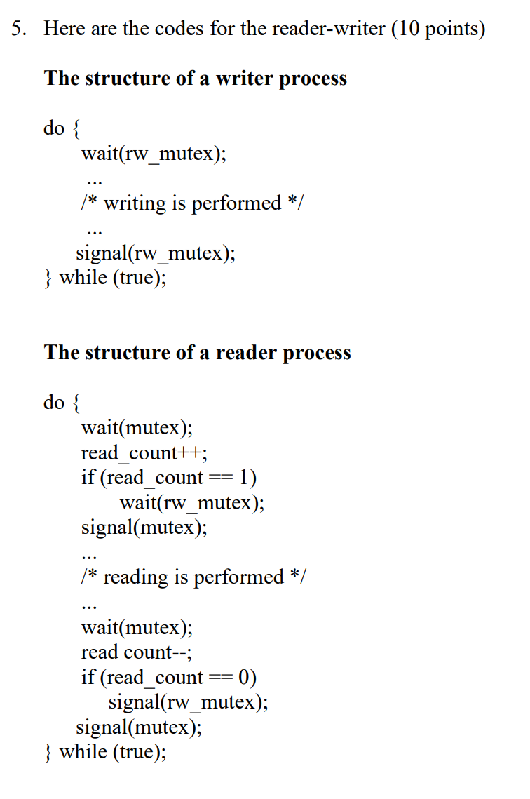

# assignment one
2019051625 党禧琳


The I/O device is idle initially. When there is a I/O request,
the I/O device begins to transfer the interrupt to CPU. 
After the transfer is done, it requires some time for the CPU to be
interrupted. The CPU stops user process executing and immediately
transfers execution to a fixed location, in the timeline, that is
I/O interrput processing. The fixed location usually contains the
starting address where the service routine for the interrupt is located.
The interrupt service routine executes; on completion, the CPU resumes
the interrupted computation and comes back to user process executing.


(1) 
The process changes states from running to waiting.
The process is created at first, in which time it is in new state.
Then it is admitted and gets into the ready state. Then it is selected
by a scheduler from a list of processes. At the same time, it is transferred
by a dispatcher. Now the process gets into running state. When the process
is executed by CPU, the CPU finds that the process needs to write data
to a busy hard disk. Since the hard disk is busy, the instructions cannot
be carried on without an external change in state or event occurring.
Therefore, the process is in waiting state. Briefly speaking, the process changes
states from running to waiting.

(2)
The process changes states from running to ready.
The process's instructions are executed by CPU initially. 
However, this process is associated with extensive scientific computations.
Therefore, it will require a lot of time for CPU to finish executing.
In order to avoid this single process occupies CPU for too much time,
so that the other processes are hang for a long time, which decreases
the efficiency, the CPU execution must be interrupted after part
of the execution is done.
Therefore, this process changes states from running back to ready to
 let the other processes have chances to be executed. The process is now in
 the list of processes again.


(1)
If all processes are I/O bound, the ready queue will always be empty,
and the short-term scheduler will have little to do.

(2)
If all processes are CPU bound, the I/O waiting queue will almost always
be empty, devices will go unused, and again the system will be unbalanced.


(1)
If the problem statement means what are the possible values of "counter"
after the producer executes the while-true-loop once and consumer exe
cutes the while-true-loop once:

(1.1) counter == 7

example:
```c++
while (counter == BUFFER_SIZE);
buffer[in] = next_produced;
in = (in + 1) % BUFFER_SIZE;
register1 = counter;  // inside the counter++
register1 = register1 + 1;
counter = register1;
while (counter == 0);
next_consumed = buffer[out];
out = (out + 1) % BUFFER_SIZE;
register2 = counter;
register2 = register2 - 1;
counter = register2;
```

after this order of execution, we can see "counter" first increases by 1,
and then decreases by 1. At last, it stays the same as before.

(1.2) counter == 6

example:
```c++
while (counter == BUFFER_SIZE);
buffer[in] = next_produced;
in = (in + 1) % BUFFERSIZE;
while (counter == 0);
next_consumed = buffer[out];
out = (out + 1) % BUFFER_SIZE;
register1 = counter;
register1 = register1 + 1;
register2 = counter;
counter = register1; // 8
register2 = register2 - 1; // 6
counter = register2; // 6
```

As we can see, before "register1" assigns its value to "counter", 
"counter" assigns its value to "register2", which makes the final
value of "counter" be 6.

(1.3) counter == 8

example:
```c++
while (counter == BUFFER_SIZE);
buffer[in] = next_produced;
in = (in + 1) % BUFFERSIZE;
while (counter == 0);
next_consumed = buffer[out];
out = (out + 1) % BUFFER_SIZE;
register1 = counter;
register1 = register1 + 1;
register2 = counter;
register2 = register2 - 1; // 6
counter = register2; // 6
counter = register1; // 8
```

This is similar to the problem in the last case when final 
value of "counter" == 6. The original counter assigns its value
 to different registers sequentially, before being assigned by
 any one of them.

(2)
If the problem means "what are the possible values of 'counter' after
running the two while-true-loop for a long time", the answer will be
any number. Since for each loop, as stated above, there will be a
deviation of one.




Firstly, R1 is reading the data. At this time, "mutex" is 1, "read_
count" is 1 and "rw_mutex" is set to 0 after wait function.
Then, W1 comes. It enters the wait function. Since "rw_mutex" is 0,
 this process is blocked. Then, another reader R2 comes, it enters the
 wait function. Since "mutex" is 1 currently, it successfully pass
 the while-loop and set "mutex" to 0. "read_count" increases to be 2
. Since "read_count" is 2, this process doesn't need to call the 
wait function for "rw_mutex", it then invoke the signal function.
"mutex" is set to 1 again. Then R2 enters the reading area and reading
 is performed.

If R1 and R2 both finished reading, they will decrease the "read_count"
 into 0. At this time, signal function for "rw_mutex" is called, 
"rw_mutex" is set to 1 again. Then W1 is waked up, and it can perform writing. 


This variation of Peterson's algorithm cannot preserve mutual-exclusion.

We can check this by one example(order of execution):

```c++
flag[i] = TRUE;
flag[j] = TRUE;
turn = j;
while(flag[j]&&turn==i);//false, jump out
// j is in CS
turn = i;
while(flag[i]&&turn==j);//false, jump out
// i is in CS
```

In this case, we can see the two processes are in critical section at the same time,
 which proves that this algorithm cannot preserve mutual-exclusion.

The reason that causes this problem is context switch and loose coding.


The structure of a left-to-right pedestrian:
```c++
do{
    wait(lmutex);
    lcount++;
    if (lcount == 1)
        wait(totmutex);
    signal(lmutex);
    
    /*
     * crossing is performed
     */
    
    wait(lmutex);
    lcount--;
    if (lcount == 0)
        signal(totmutex); // unlock the total mutex
    signal(lmutex);
} while(true);
```

The structure of a right-to-left pedestrian:
```c++
do{
    wait(rmutex);
    rcount++;
    if (rcount == 1)
        wait(totmutex);
    signal(rmutex);
    
    /*
     * crossing is performed
     */
    
    wait(rmutex);
    rcount--;
    if (rcount == 0)
        signal(totmutex);
    signal(rmutex);
} while(true);
```

The initial values of "rmutex", "totmutex"" and "lmutex" are 1.

The basic idea of this solution is that: we define a mutex for the
 availability of the single-plank bridge. When someone is crossing
 the bridge, it is not allowed for people from the other direction to
 pass. So the first person to enter the bridge will lock the bridge.
 If the second person is from the same direction, it needs not to 
wait for the lock of the bridge and can cross it directly. When the
 third person is from the different direction, it is also the first person
 of the different direction, of course. It will need to wait for
 the bridge to unlock and stuck. If the fourth person is also from
 the second direction, it even cannot enter the count section because
 the third person has lock it and it hasn't get out from it. Therefore, pedestrians from the other
 direction cannot cross while ones from the same direction can. This 
situation continues until the pedestrians from the first direction
 have finished crossing. 

It is obvious that the three conditions: mutual-exclusion,
 progress and bounded waiting can be preserved.